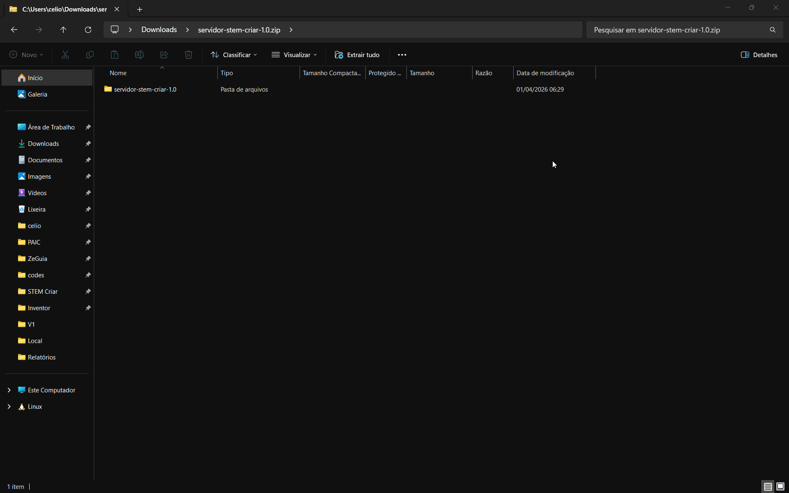
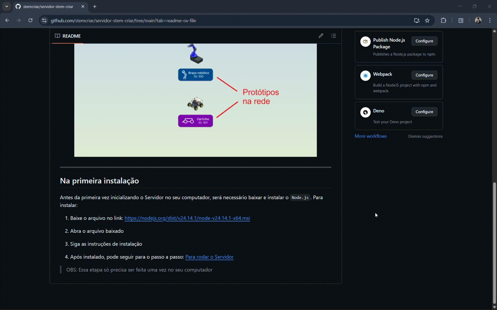

# Servidor STEM Criar

Este repositório armazena o código do Servidor de controle dos Protótipos desenvolvidos pelo time Stem Criar.

## Para rodar o Servidor

1. Baixe o arquivo .zip no link: https://github.com/stemcriar/servidor-stem-criar/archive/refs/tags/1.0.zip

Veja mais

  

2. Descompacte o arquivo baixado

Veja mais

  

3. Abra a pasta e clique duas vezes no arquivo `run`

Veja mais

  

4. Em poucos segundos, o **Servidor STEM Criar** abrirá em seu navegador

  

---

## Na primeira instalação

Antes da primeira vez inicializando o Servidor no seu computador, será necessário baixar e instalar o `Node.js`. Para instalar:

1. Baixe o arquivo no link: https://nodejs.org/dist/v24.14.1/node-v24.14.1-x64.msi

2. Abra o arquivo baixado

3. Siga as instruções de instalação

Veja mais

  

4. Após instalado, siga para o passo a passo: [Para rodar o Servidor](#para-rodar-o-servidor) acima ☝️

> OBS: Essa etapa só precisa ser feita **uma vez** no seu computador
