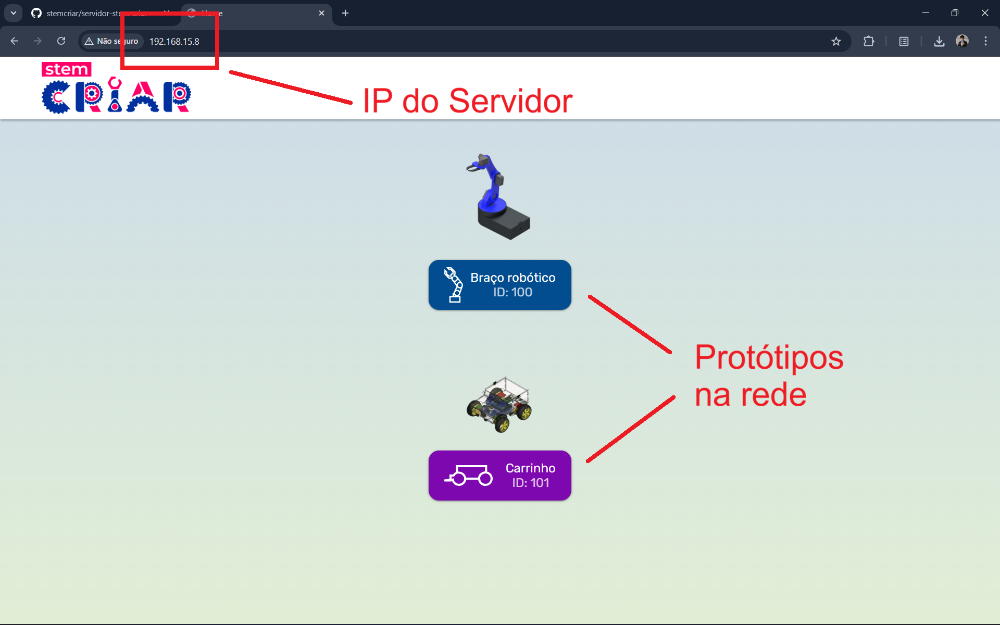

# Guia Completo: Servidor STEM Criar e Protótipos

Este material foi preparado para conectar e controlar os protótipos de forma rápida e didática. Siga os passos!

---

## Passo 1: Como abrir o Servidor

Nesta etapa vamos ligar a "central de comando" no seu computador. (Essa etapa supõe que você já instalou o Node.js — caso contrário, veja a seção de Pré-Requisito no fim desta página).

1. Baixe o [arquivo do Servidor](https://github.com/stemcriar/servidor-stem-criar/archive/refs/tags/2.2.zip) em formato `.zip` e descompacte (extraia a pasta) no seu computador.
2. Abra a pasta descompactada e clique duas vezes no arquivo **`run`**.
3. Aguarde alguns segundos e, em seguida, a tela do **Servidor STEM Criar** abrirá no seu navegador.
4. Você pode acessar o servidor de qualquer dispositivo que estiver na mesma rede que o computador (como seu celular ou tablet) digitando o endereço IP do servidor no navegador do dispositivo.
5. Se já tiver protótipos configurados corretamente, eles aparecerão na tela do Servidor.

> **⚠️ AVISOS IMPORTANTES:**
> - **Rede:** O seu computador DEVE estar na mesma rede WiFi que você deseja conectar os protótipos.
> - **Exclusividade:** Este passo deve ser feito em **APENAS UM COMPUTADOR** na rede WiFi para não gerar conflitos ou sobrecarregar o sistema.
> - **Fechar o servidor:** Para fechar o servidor, basta fechar a janela do terminal (cmd).
> - **Abrir novamente o servidor:** Para abrir o servidor novamente, basta clicar duas vezes no arquivo **`run`**.
> - **Tela de Segurança Insegura:** Ao abrir o Servidor, seu navegador pode exibir uma tela de conexão "Não Segura". Ignore o aviso! Clique em **Avançado** e depois em **Ir para [IP] (não seguro)**.

  

### ❗ Possíveis Erros ao abrir o Servidor
- **A tela preta pisca e fecha sem abrir o site:** O "Node.js" não está instalado no seu computador. Vá até o final da página e veja como realizar a instalação que é feita apenas uma vez!
- **O Windows Defender bloqueou o comando "run":** Trata-se de nosso arquivo seguro. Clique em "Mais informações" e depois em "Executar assim mesmo".
- **O Servidor abriu, mas não consigo acessar ele do celular:** Verifique se as permissões de Firewall e "Rede Aberta/Pública" do Windows estão ativas. O WiFi deve estar configurado como "Rede Particular (Private)".

---

## Passo 2: Conectando os Protótipos

Com a tela do **Servidor aberta no seu computador**, é hora de conectar todos os protótipos (Carrinhos e Manipuladores)! Todos os protótipos serão conectados no Servidor STEM Criar que está rodando no seu computador.

Ligue o protótipo no botão. Agora, preste atenção se acontecerá a Situação 1 ou a Situação 2.

### 🟡 Situação 1: O protótipo ainda NÃO ESTÁ na rede WiFi
Como o robô não sabe a senha do seu WiFi, ele criará a própria rede de configuração dele.
1. No seu celular ou notebook, busque as Redes WiFi. 
2. Você encontrará uma rede chamada **Config-ESP-[ID]** (Ex: `Config-ESP-STEM001`). 
3. Conecte-se nela (não possui senha).
4. Uma tela de configuração vai abrir sozinha com vários botões. 
5. Clique no segundo botão, `Setup` (Configuração), e nele tem o campo de **IP do Servidor**. Digite *apenas os números (com pontos) do endereço IP* do Servidor que está rodando no seu computador (por exemplo: `192.168.15.9`).
6. Volte para a tela inicial e clique no primeiro botão, `Configure WiFi`. Irá aparecer as redes disponíveis, **selecione a rede do laboratório** e coloque a **senha** dela.
7. Clique em Salvar e Desligue e ligue o robô! Ao ligar novamente, ele já estará conectado ao WiFi local procurando o IP do seu Servidor que você acabou colocar.

> **⚠️ DICA:** Como mudar de WiFi depois?
> Se o robô entrar na sua rede WiFi e você precisar fazer alguma manutenção nele depois (como mudar manualmente para outro WiFi, alterar o IP do servidor, atualizar o firmware, ver informações técnicas e etc.), basta você digitar `[ID].local` no navegador do celular enquanto estiver na mesma rede WiFi que o protótipo! Essa janela .local só será usada para manutenções finas na rede interna.

### 🟢 Situação 2: O protótipo JÁ ESTÁ conectado à rede WiFi
Você ligou o protótipo, ele se conectou no seu WiFi automaticamente (porque já estava conectado anteriormente), mas **mesmo assim ainda não apareceu na tela do Servidor**:

1. Fique com seu celular/notebook na mesma rede WiFi que ele está conectado (você deve saber qual rede WiFi é essa).
2. Abra o navegador e digite o endereço do protótipo que você deseja procurar. Ele segue esse padrão: `[ID].local` (Exemplo: `CAR001.local`).
3. Na página de configuração, que abrirá em alguns segundos, veja a parte do `Setup`. Verifique para qual IP do Servidor ele está procurando.
4. Veja se esse número é diferente do IP do Servidor STEM Criar atual. Se for, corrija e salve.

> **⚡ ATENÇÃO (Para ambas as Situações):**
> Após preencher formulários de Setup e pressionar os botões de "Salvar" no protótipo, **você deve desligar a chave física dele no botão, e religá-la** para que as conexões sejam validadas e atualizadas do zero com certeza!

### ❗ Possíveis Erros com Protótipos
- **Coloquei a Senha do WiFi errada e salvei:** O carrinho vai ser desconectado e vai reiniciar, mas não conseguirá entrar na internet. Como não conseguirá, ele voltará pra tela de emitir o próprio WiFi temporário "Config-ESP-[]". É só ligar lá e refazer.
- **Meu celular Android não abre "[ID].local" de jeito nenhum!** Infelizmente isso é uma limitação da marca/DNS de certos modelos de celular. Use um outro dispositivo (notebook) para acessar essa aba.
- **Eu já configurei tudo mas o robô não aparece na tela Home do Servidor!** Reinicie o Servidor Node (`run` no computador). E tenha 100% de firmeza de que o Computador Principal (hospedeiro) e o protótipo ligado estão no mesmo  WiFi.

<!-- ---

> _**Para um acompanhamento mais visual de todo esse passo a passo, veja o vídeo abaixo!**_
> [ INSIRA AQUI NESTE MODO O LINK SEU VÍDEO NO YOUTUBE QUANDO CONCLUÍDO ] -->

---

## Pré-Requisito (Node.js)
Se o computador que rodará o servidor nunca foi programado com Node.js, ele não saberá processar a interface do site.

* **Objetivo:** O arquivo a seguir é chamado Node. Ele só precisa obrigatoriamente ser ser baixado e instalado (Next > Next > Next) no computador que rodará o servidor para instalar as suas bibliotecas. Após instalado uma vez, não será mais necessário instalá-lo de novo.
* **Download:** [Baixe o Node.js](https://nodejs.org/dist/v24.14.1/node-v24.14.1-x64.msi).
